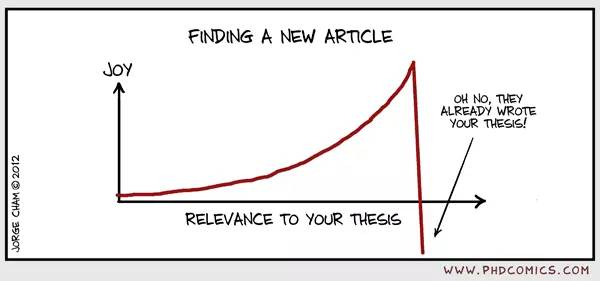

# [](#header-1)Tutorials of Xilinx ZCU104

[1. How to format SD card and run ZCU104 with pre-built petalinux](./post/zcu104_tutorial_1)

[2. Connect PC and ZCu104 directly using ethernet cable](./post/zcu104_tutorial_2)

--------------------------------------------------------------------------------------------
# [](#header-1)FPGA炼丹炉


[神经网络的FPGA实现之坑一： MATLAB Neural Network Toolbox](./post/2018-02-23-FPGA-keng-1)

[神经网络的FPGA实现之坑二： MATLAB HDL Coder](./post/2018-02-23-FPGA-keng-2)

[神经网络的FPGA实现之坑三：基于HDL Coder的DDR4接口模型详解](./post/2018-08-20-FPGA-keng-3)

--------------------------------------------------------------------------------------------
# [](#header-1)Tips for Matlab HDL Toolbox Series


[基于Matlab HDL Coder的8x8实矩阵QR分解](./post/2018-11-04-hdlcoder-1)

[关于MATLAB神经网络生成HDL的实例](./post/2018-11-07-hdlcoder-2)

[HDL Coder生成Xilinx DSP48E1注意事项](./post/2019-06-18-hdlcoder-3)

--------------------------------------------------------------------------------------------
# [](#header-1)Research


[My Publication](./post/papers)

--------------------------------------------------------------------------------------------

# [](#header-1)About Me
I am currently a PhD student in Department Electrical and Computer Engineering, Worcester Polytechinic Institute. My research interest are: `Computer Vision`, `Deep Learning`, `Autonomous Driving`, `FPGA`.

<i class="far fa-file"></i> [Résumé](./docs/resume.pdf)

--------------------------------------------------------------------------------------------

# [](#header-1)Contact
<i class="fa fa-weixin fa-2x"></i> [白磷](./post/contact) <i class="far fa-envelope fa-2x"></i> [Gmail](./post/contact) <i class="fas fa-book fa-2x"></i> [Publications](https://scholar.google.com/citations?user=L7gsnOEAAAAJ&hl=en)


<!---
[link to another page](./_post_test/2018-02-23-FPGA-keng-1)

Text can be **bold**, _italic_, ~~strikethrough~~ or `keyword`.

There should be whitespace between paragraphs.

There should be whitespace between paragraphs. We recommend including a README, or a file with information about your project.

# [](#header-1)Header 1

This is a normal paragraph following a header. GitHub is a code hosting platform for version control and collaboration. It lets you and others work together on projects from anywhere.

## [](#header-2)Header 2

> This is a blockquote following a header.
>
> When something is important enough, you do it even if the odds are not in your favor.

### [](#header-3)Header 3

```js
// Javascript code with syntax highlighting.
var fun = function lang(l) {
  dateformat.i18n = require('./lang/' + l)
  return true;
}
```

```ruby
# Ruby code with syntax highlighting
GitHubPages::Dependencies.gems.each do |gem, version|
  s.add_dependency(gem, "= #{version}")
end
```

#### [](#header-4)Header 4

*   This is an unordered list following a header.
*   This is an unordered list following a header.
*   This is an unordered list following a header.

##### [](#header-5)Header 5

1.  This is an ordered list following a header.
2.  This is an ordered list following a header.
3.  This is an ordered list following a header.

###### [](#header-6)Header 6

| head1        | head two          | three |
|:-------------|:------------------|:------|
| ok           | good swedish fish | nice  |
| out of stock | good and plenty   | nice  |
| ok           | good `oreos`      | hmm   |
| ok           | good `zoute` drop | yumm  |

### There's a horizontal rule below this.

* * *

### Here is an unordered list:

*   Item foo
*   Item bar
*   Item baz
*   Item zip

### And an ordered list:

1.  Item one
1.  Item two
1.  Item three
1.  Item four

### And a nested list:

- level 1 item
  - level 2 item
  - level 2 item
    - level 3 item
    - level 3 item
- level 1 item
  - level 2 item
  - level 2 item
  - level 2 item
- level 1 item
  - level 2 item
  - level 2 item
- level 1 item

### Small image


### Large image


### Definition lists can be used with HTML syntax.

<dl>
<dt>Name</dt>
<dd>Godzilla</dd>
<dt>Born</dt>
<dd>1952</dd>
<dt>Birthplace</dt>
<dd>Japan</dd>
<dt>Color</dt>
<dd>Green</dd>
</dl>

```
Long, single-line code blocks should not wrap. They should horizontally scroll if they are too long. This line should be long enough to demonstrate this.
```

```
The final element.
```
-->

<head> 
    <script defer src="https://use.fontawesome.com/releases/v5.0.13/js/all.js"></script> 
    <script defer src="https://use.fontawesome.com/releases/v5.0.13/js/v4-shims.js"></script> 
</head> 
<link rel="stylesheet" href="https://use.fontawesome.com/releases/v5.0.13/css/all.css">


